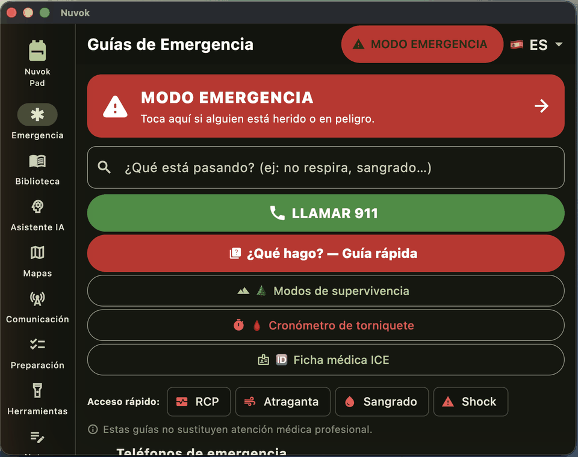
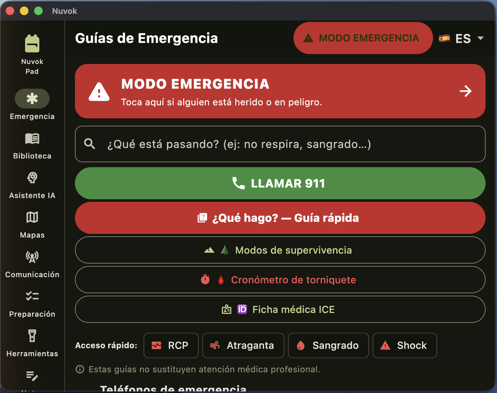
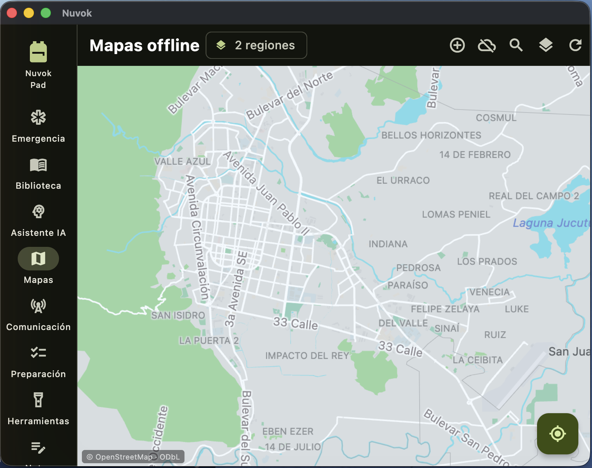
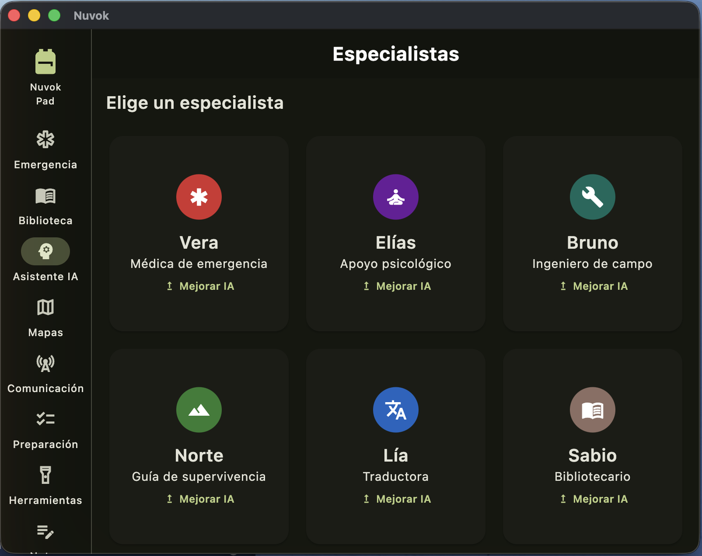
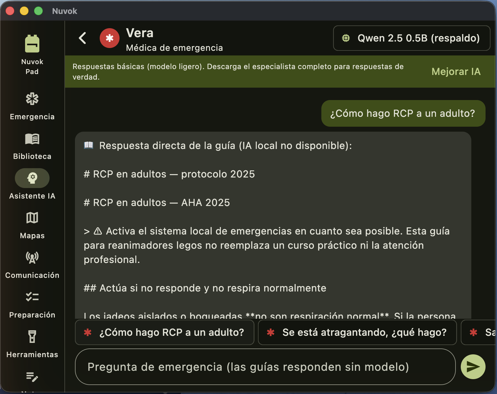

# Nuvok

[Español](README.md) · **English**

<p align="center"></p>

[](https://github.com/scottorellana/nuvok/actions/workflows/ci.yml)
[](LICENSE)
[](#-local-ai-on-your-iphone-step-by-step)

**Knowledge that doesn't go dark.** Emergency guides, Wikipedia, maps, an AI
assistant and mesh communication — all working **without internet**, with no
servers and no accounts. Born from the blackout that left Venezuela three
days without internet: Nuvok exists for the moment the network disappears.

| Module | What it does |
|---|---|
| 🚨 Emergency | Original first-aid and survival guides with symptom search, in 7 languages |
| 🧠 AI Assistant | AI specialists that run **inside your phone** (llama.cpp + Metal), grounded in your offline guides |
| 📖 Library | Wikipedia and books, offline (Kiwix `.zim`) |
| 🗺️ Maps | Offline maps with GPS, street routing and "take me to…" (`.pmtiles`) |
| 📡 Communication | Bluetooth/WiFi mesh with no internet: encrypted chat, an SOS that relays itself, group positions |
| 📦 Depot | Where you pick and download your content (the only place that uses internet) |

<p align="center">
  
  
</p>
<p align="center">
  
  
</p>

---

## Install Nuvok

The app installs **light**; the heavy content (AI, maps, encyclopedia) is
yours to choose afterwards, based on your device and your region.

### 🖥 macOS (Apple Silicon)

1. Download `Nuvok.dmg` from [nuvok.org](https://nuvok.org) and verify the
   SHA-256 published next to the link.
2. Drag **Nuvok** into Applications.
3. First launch: right-click → **Open**.

### 🤖 Android

1. Download the `.apk` from [nuvok.org](https://nuvok.org) (or get it from
   someone who already has Nuvok — see below).
2. Open it and allow "install apps from unknown sources" when Android asks.

**No internet?** Any Android phone with Nuvok can hand you the app: on the
other device, **Depot → Send Nuvok to another phone** creates a page on the
local WiFi network (a hotspot with no data plan works) where you download
the APK. That's how it spreads during a blackout.

### 📱 iPhone

Nuvok is not on the App Store yet (see [License](#license)); today you
install it by building it yourself, with a Mac:

1. Install [Xcode](https://apps.apple.com/app/xcode/id497799835) (free) and
   [Flutter](https://docs.flutter.dev/get-started/install/macos).
2. Clone this repository and build the AI engine (one time only):

   ```bash
   git clone --depth 1 https://github.com/scottorellana/nuvok.git
   cd nuvok && ./scripts/bootstrap.sh   # deps + llama.cpp + native engines
   ./scripts/build_llm_ios.sh           # iPhone AI engine (Metal)
   ./scripts/build_native_ios.sh        # library decompressor
   ```

3. Plug in your iPhone and run `flutter run --release`. Xcode will ask you
   to sign in with your Apple ID to sign the app (a free account works; the
   app expires after 7 days and reinstalls just as fast).
4. On the iPhone: Settings → General → VPN & Device Management → trust your
   developer certificate.

Requirements: iOS 13 or newer. Verified working on real hardware.

### 🪟 Windows / 🐧 Linux

They build on CI and the AI runs through a local `llama-server` process;
verification on real hardware is still pending. Instructions in
[CONTRIBUTING.md](CONTRIBUTING.md).

---

## 🧠 Local AI on your iPhone, step by step

No cloud, no account, no API key: the model runs on your phone's chip and
**nothing you ask ever leaves the device**.

1. Open Nuvok and tap **AI Assistant** in the bottom bar.
2. Tap **Download**. You don't need to know anything about models: the app
   measures your device's memory and picks the best one it can handle.
3. Wait for the download on WiFi (0.5–3.4 GB depending on your device; it is
   verified with SHA-256 and resumes if interrupted). **This is the only time
   internet is needed.**
4. Done. Turn on airplane mode and ask away: the specialists answer using
   your offline guides as cited sources.

What to expect on your device:

| Your device | Model the app picks | Download | How it responds |
|---|---|---|---|
| iPhones with 8 GB RAM (15 Pro or newer) and Macs | Gemma 4 E2B | 3.4 GB | Specialist-level, ~100 tokens/s measured on a 15 Pro |
| Most recent iPhones and Androids | Qwen 2.5 1.5B | 1.1 GB | Coherent and useful |
| Low-memory devices | Qwen 2.5 0.5B | 0.5 GB | Basic: short answers, literal guides |

In **Depot → Models** you can install others (each shows its license before
downloading). The same steps work on Android and macOS.

---

## First steps after installing

In **📦 Depot** you assemble your survival pack — before you need it:

- **Your map**: 58 countries available, or clip any region of the world.
- **Medical Wikipedia** in your language, plus more books from the Kiwix
  catalog.
- **Your AI model** (see above).

Everything lives in a portable `Nuvok/` folder (`zim/`, `maps/`, `models/`,
`mesh/`, `notes/`): copy it over USB to another device running Nuvok and
your library travels with you — nothing downloads twice.

## And when there's no internet?

Everything above keeps working — that's the point. On top of that, the
**Communication** tab connects nearby phones to each other over Bluetooth
and local WiFi, forming a mesh: per-channel encrypted chat (AES-256-GCM),
group positions on the map, and an **SOS** that hops from phone to phone,
gets stored, and is re-sent to whoever shows up later — with nobody having
signal. The honest details and limits of the encryption are in
[SECURITY.md](SECURITY.md).

## How much can you trust the AI?

Not much on its own — and we measured that instead of assuming it. A model of a
few billion parameters will confidently tell you to put ice on a burn and to
loosen a tourniquet in the field. Both cause harm.

So Nuvok never lets it answer alone: it puts its own emergency guides in front
of the model, and with those the same model answers correctly. When there is no
source to inject, the answer is labelled as generated without backing, and on
clinical ground a notice appears saying this does not replace medical care.

The measurements, the case that already bit us once, and how to reproduce it
are in [docs/IA_SEGURIDAD.md](docs/IA_SEGURIDAD.md).

## Buy or build?

Both paths are legitimate:

- **Buying at [nuvok.org](https://nuvok.org)** gets you the official signed
  binaries, updates and fast package downloads — and funds the project.
- **Building it yourself** is free and always will be: the complete source
  is here under the GPL. Instructions in [CONTRIBUTING.md](CONTRIBUTING.md).

The app can also check for a new version when it detects internet (it never
updates itself and never blocks offline use), and
`node installer-server/server.js` starts an installer on your local WiFi to
hand the app and your already-downloaded content to the other devices in
the house.

## Development — from zero in 3 commands

```bash
git clone --depth 1 https://github.com/scottorellana/nuvok.git
cd nuvok && ./scripts/bootstrap.sh
flutter run -d macos
```

`bootstrap.sh` does everything: dependencies, native engines (local AI with
Metal included) and the verification suite (569 tests). Requirements:
Flutter and, on macOS, cmake. Linux: `flutter run -d linux` (AI uses a
system `llama-server`). Android: `flutter build apk` after bootstrap.

Full guide (and the CLA) in [CONTRIBUTING.md](CONTRIBUTING.md) ·
vulnerabilities via [SECURITY.md](SECURITY.md).

## License

Copyright © 2026 Scott Orellana.

Nuvok is free software under the **[GNU General Public License v3](LICENSE)**.
You may use it, study its code, modify it and redistribute it under those
same terms. It comes with **absolutely no warranty**.

The code being open is deliberate: an app that promises nothing leaves your
device must be able to prove it. Anyone can audit the mesh encryption and
verify the AI runs locally. The GPL also ensures community improvements come
back to the community.

**Selling binaries is compatible with the GPL.** Nuvok is sold at nuvok.org;
the license requires giving the source code to whoever receives the binary —
not giving the binary away.

One consequence worth knowing: GPL v3 is **incompatible with Apple's App
Store** (its terms impose usage restrictions the GPL forbids). Nuvok is
distributed directly from its website, so this doesn't apply today. To
publish on the App Store, the copyright holder can dual-license without this
repository ever leaving the GPL — which is why contributions require a CLA
(see [CONTRIBUTING.md](CONTRIBUTING.md)).

Nuvok incorporates third-party work under its own licenses —
[llama.cpp](https://github.com/ggml-org/llama.cpp) (MIT),
[zstd](https://github.com/facebook/zstd) (BSD), Apache 2.0 models, the
[Kiwix](https://kiwix.org) catalog (CC BY-SA) and
[Protomaps](https://protomaps.com)/OpenStreetMap maps (ODbL). The notices
those licenses require are in [NOTICE.md](NOTICE.md) and inside the app,
under Settings → Credits and licenses.

Downloadable content (maps, encyclopedia, models) is **not Nuvok's** and
keeps its original license: the GPL covers the code, not that material.

Inspired by [Project N.O.M.A.D.](https://github.com/Crosstalk-Solutions/project-nomad)
(Apache 2.0), rethought from a Docker server into a native app.

### Trademark

"Nuvok", its logo and nuvok.org are **not** part of the license: they
identify the official builds. A fork may use all the code under the GPL, but
must ship under a different name and logo. Same rule as Firefox or Grafana:
the code is free; the trust in the name is not.
